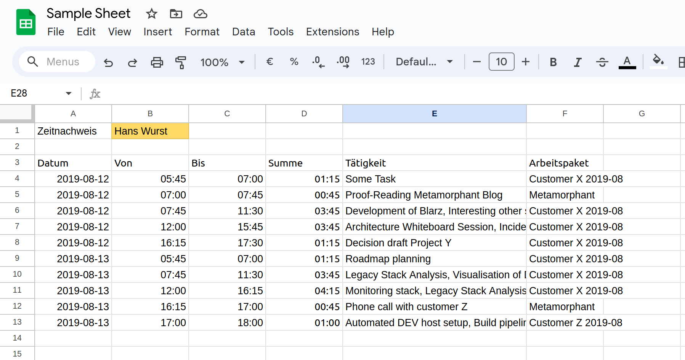

# Where can I learn about the Google Sheets API?

Start with the [Java Quickstart Guide for the Google Sheets API](https://developers.google.com/sheets/api/quickstart/java).

Before version 1.3.1, parti-time was using Google's Java API packages:
* https://cloud.google.com/java/docs/reference/google-oauth-client/latest/overview
* https://cloud.google.com/java/docs/reference/google-api-client/latest/overview
* https://cloud.google.com/java/docs/reference/google-http-client/latest/overview
* https://googleapis.dev/java/google-api-services-sheets/latest/overview-summary.html

All Java APIs are just auto-generated wrappers of the underlying [Google Sheets REST API](https://developers.google.com/sheets/api/reference/rest).

Starting with version 1.3.1, parti-time is using [Timothy Pratley's native clojure Google Client lib happygapi](https://github.com/timothypratley/happygapi).

# How do I have to setup my Google API Client?

This recipe is mostly equivalent to the setup described in the [Java Quickstart Guide for the Google Sheets API](https://developers.google.com/sheets/api/quickstart/java).

* Create a new project `parti-time` in [Google Cloud Console](https://console.cloud.google.com/welcome?project=parti-time).
* Enable the Google Sheets API ("Enabled APIs & services")
* Configure the "OAuth Consent Screen" (only the minimum config needed)
* Authorize "Credentials"
  * Create "OAuth Client ID"
  * Type: Desktop App
  * Name: "parti-time CLI"
* Download `credentials.json` to `~/.config/parti-time/credentials.json`

# What does a metamorphant Google Sheet format look like?

In order to use the google sheet download/append features, you will need a Google Sheet in a metamorphant compatible format.

The google sheet integration applies the following [format checks](/src/main/clj/parti_time/google_sheets/timeline.clj#L24):

* A1: Zeitnachweis
* B1: Your name (non-blank)
* Row 2: Empty
* A3: Datum
* B3: Von
* C3: Bis
* D3: Summe
* E3: Tätigkeit
* F3: Arbeitspaket

For the actual rows, you will want to configure

* Column A: custom number format `yyyy-mm-dd`
* Column B: custom number format `hh:mm`
* Column C: custom number format `hh:mm`
* Column D: Formula C-B, e.g. C4-B4 for D4, custom number format `[hh]:mm`

It is a known limitation of the current integration, that it doesn't configure those properties. Also, there is currently no support for creating new timesheet Google Sheets.
